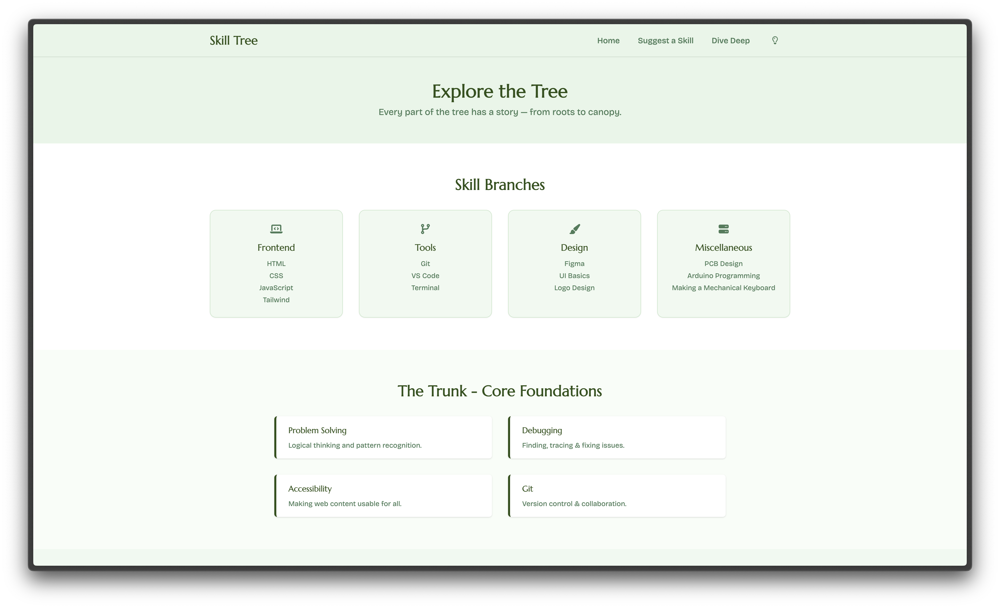
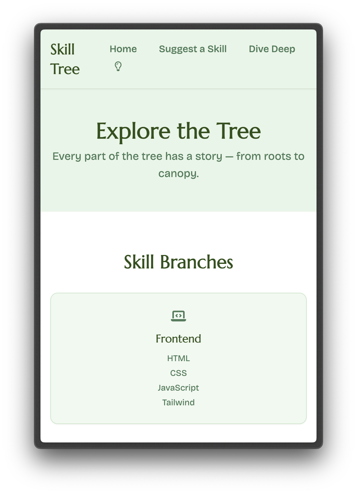

# Skill Tree
a skill tree (literal tree) made using html and tailwind css.

## Overview

### Tech Stack
- HTML
- Tailwind CSS
- JavaScript

### Features
- home page
    - skills as leaves on the branches on a tree made from css grid
    - click on a skill to view more details 
    - a fake submission form for suggesting skills to add
- a dive deep page:
    - multiple types of cards layouts
    - horizontal timeline
    - vertical timeline
- responsive layout
- light/dark mode
- Animation In on elements

## Images

## Credits
- made by: [Unowen](htps://github.com/pari55051)
- made for: [Grub - Hackclub](https://grub.hackclub.com/)
- icons: [Font Awesome](https://fontawesome.com/)
- fonts: [Marcellus - Google Fonts](https://fonts.google.com/specimen/Marcellus), [Bricolage Grotesque](https://fonts.google.com/specimen/Bricolage+Grotesque)