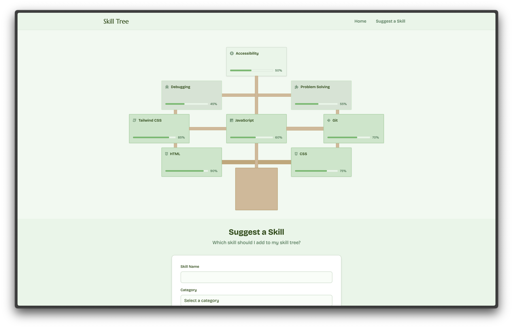
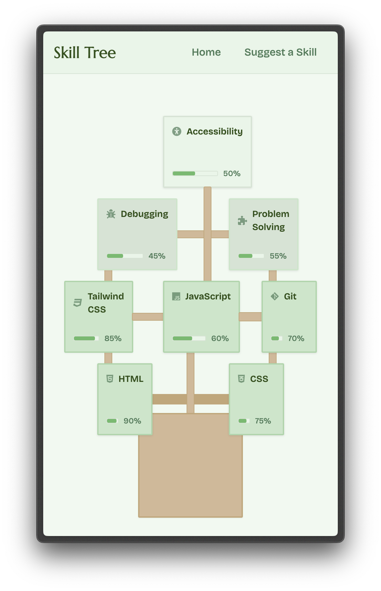

# Skill Tree
a skill tree (literal tree) made using html and tailwind css.

## Overview

### Tech Stack
- HTML
- Tailwind CSS
- JavaScript

### Features
- skills as leaves on the branches
- click on a skill to view more details
- a fake submission form for suggesting skills to add
- a navbar + footer
- responsive layout

## Images

## Credits
- made by: [Unowen](htps://github.com/pari55051)
- made for: [Grub - Hackclub](https://grub.hackclub.com/)
- icons: [Font Awesome](https://fontawesome.com/)
- fonts: [Marcellus - Google Fonts](https://fonts.google.com/specimen/Marcellus), [Bricolage Grotesque](https://fonts.google.com/specimen/Bricolage+Grotesque)